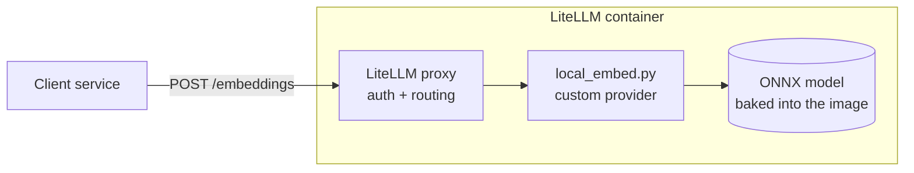

# litellm-local-embeddings

A LiteLLM proxy image that computes embeddings in-process instead of forwarding them to Bedrock,
OpenAI or another upstream, plus the experiment that was run to decide which model to put in it.



Routing is stock LiteLLM. The only custom part is the provider at the end of the route:
`local_embed.py` is registered through `custom_provider_map` and runs the model with ONNX Runtime,
so there is no sidecar and no network call.

## 1. Question

A product calls LiteLLM's OpenAI-compatible `/embeddings` endpoint and expects 1536-dimension
vectors, which it uses to cluster and search source code. The planned upstream was a hosted
embedding API. Can the same LiteLLM instance serve those embeddings locally, on CPU, and how
large a model does it need?

## 2. Hypotheses

- **H1.** A LiteLLM custom provider can serve embeddings in-process while keeping the client
  contract unchanged (endpoint, request and response shape, auth, 1536 dimensions).
- **H2.** A small model (`bge-small-en-v1.5`, 33M parameters) is fast enough on CPU to embed a
  codebase in a practical time.
- **H3.** A larger or code-specific model groups related source files measurably better than the
  small one. If H3 fails, the small model is the right default.

## 3. Method

**Models**

| Model | Parameters | Native dimension | Why included |
|---|---|---|---|
| `BAAI/bge-small-en-v1.5` | 33M | 384, zero-padded to 1536 | Smallest practical option |
| `jinaai/jina-embeddings-v2-base-code` | 161M | 768, padded | Trained on code |
| `BAAI/bge-large-en-v1.5` | 335M | 1024, padded | Larger general-purpose model |
| `Alibaba-NLP/gte-Qwen2-1.5B-instruct` | 1.5B | 1536 | Native 1536, no padding |

Zero-padding does not change cosine similarity, dot product or L2 distance, so a padded vector
behaves exactly like its native-size original.

**Setup.** LiteLLM 1.83.14, ONNX Runtime 1.30, M5 Max MacBook (18 cores). Three runtimes: CPU
inside the container, CPU natively on the host, and GPU natively through CoreML. The upstream
LiteLLM image is x86-only, so the container runs under emulation on this machine; container
figures are therefore a lower bound for real x86 hardware.

**H1, contract.** `test.sh` runs 18 checks from a client on a network with no internet route:
response shape, four auth header styles, OpenAI SDK default and float encodings, base64,
token-array input, batch input, the `dimensions` parameter, over-length input.

**H2, throughput.** `stress.py` runs 15 seconds per scenario at 1, 8, 32 and 64 concurrent
clients with one ~130-token text per request. `embed_dir.py` times embedding the `src` directory
of [spring-petclinic](https://github.com/spring-projects/spring-petclinic): 93 files, 371 chunks
of up to 1,500 characters, 16 concurrent requests.

**H3, clustering quality.** `quality.py` embeds every Java file under `src/main/java` in three
multi-module Spring codebases and checks whether the vectors recover each file's module:

| Corpus | Files | Modules |
|---|---|---|
| [spring-petclinic-microservices](https://github.com/spring-petclinic/spring-petclinic-microservices) | 50 | 5 |
| [piggymetrics](https://github.com/sqshq/piggymetrics) | 66 | 4 |
| [ftgo-application](https://github.com/microservices-patterns/ftgo-application) | 274 | 9 |

One vector per file (mean of its chunk vectors). The label is the file's top-level module.
`package` and `import` lines are stripped and paths are not embedded, so the module name does not
leak into the text. Three measures, each compared against random vectors:

- **kNN accuracy**: leave-one-out, does the majority of a file's 5 nearest neighbours share its module.
- **k-means NMI**: k-means with k = number of modules, 10 seeds.
- **UMAP + HDBSCAN NMI**: BERTopic's default pipeline (UMAP to 5 dimensions, then HDBSCAN), 5 seeds.

## 4. Results

### H1: contract

18 of 18 checks pass. The container also serves requests with networking disabled
(`--network none`). The converted Qwen model was compared with the original through
sentence-transformers and returns identical vectors (cosine 1.0).

### H2: throughput

Time to embed the PetClinic `src` directory:

| Runtime | bge-small | jina-code | bge-large | Qwen |
|---|---|---|---|---|
| CPU, container (emulated x86) | 15 s | 73 s | 188 s | 747 s |
| CPU, native | 4.5 s | 16 s | 46 s | 318 s |
| GPU, native (CoreML) | 12 s | not run | 30 s | failed to load |

Peak requests per second under load:

| Runtime | bge-small | jina-code | bge-large | Qwen |
|---|---|---|---|---|
| CPU, container (emulated x86) | 56 | 15 | 6 | 1.4 |
| CPU, native | 208 | 69 | 22 | 5 |
| GPU, native (CoreML) | 121 | not run | 81 | failed to load |

| | bge-small | jina-code | bge-large | Qwen |
|---|---|---|---|---|
| Image size | 0.7 GB | 1.0 GB | 1.4 GB | 5.9 GB |
| Container memory | 1 GB | 3.3 GB | not measured | 11 GB |

No CPU run returned an error. The CoreML path crashed on batches of 32 under sustained load with
both bge models and could not load Qwen, so it is not a usable GPU path. No NVIDIA GPU was tested.

### H3: clustering quality

kNN accuracy (higher is better):

| Model | petclinic-ms | piggymetrics | ftgo |
|---|---|---|---|
| random vectors | 0.18 | 0.29 | 0.17 |
| bge-small | 0.48 | 0.59 | **0.65** |
| jina-code | 0.56 | 0.56 | 0.58 |
| bge-large | **0.60** | 0.56 | 0.64 |
| Qwen | 0.48 | **0.64** | 0.65 |

UMAP + HDBSCAN NMI (the BERTopic-style pipeline):

| Model | petclinic-ms | piggymetrics | ftgo |
|---|---|---|---|
| random vectors | 0.08 | 0.08 | 0.08 |
| bge-small | 0.12 | **0.40** | **0.34** |
| jina-code | 0.03 | 0.29 | 0.28 |
| bge-large | **0.19** | 0.34 | 0.28 |
| Qwen | 0.15 | 0.32 | 0.32 |

k-means NMI:

| Model | petclinic-ms | piggymetrics | ftgo |
|---|---|---|---|
| random vectors | 0.09 | 0.06 | 0.06 |
| bge-small | 0.15 | **0.37** | **0.30** |
| jina-code | **0.24** | 0.30 | 0.14 |
| bge-large | 0.17 | 0.36 | 0.22 |
| Qwen | 0.13 | 0.37 | 0.22 |

On the largest corpus (ftgo, 274 files) bge-small is best or tied on all three measures. Across
the nine corpus-and-measure combinations it is best or tied in five; no other model is best in more
than two. The models also largely agree with each other: on ftgo, bge-small shares 63% of each file's
top-10 neighbours with Qwen and 66% with bge-large. Full output including ARI is in
`results/quality.jsonl`.

## 5. Limitations

- **The module label is a proxy.** Files in different services often play the same role
  (controller, entity, configuration) and look alike, which caps the achievable score for every
  model. Absolute values are modest for that reason; the comparison between models is the useful part.
- **Small corpora, one language.** The two small corpora (50 and 66 files) are noisy, and all
  three are Java/Spring. Other languages were not tested.
- **Not the product's pipeline.** The UMAP + HDBSCAN run uses BERTopic's default parameters on
  file-level vectors. The real pipeline's chunking, parameters and data will differ.
- **512-token inputs.** Jina and Qwen accept much longer inputs; that advantage was not exercised.
- **Qwen was used without an instruction prefix**, as the model card recommends for documents.
- **Container speed is emulated x86.** Native x86 throughput was not measured.

## 6. Conclusion

- **H1 holds.** LiteLLM serves embeddings in-process with the client contract intact and no
  outbound network access.
- **H2 holds.** bge-small embeds a small Spring codebase in 15 seconds in an emulated container
  and sustains 56 requests per second; native CPU is about four times faster.
- **H3 is not supported.** On these corpora neither the larger models nor the code-specific model
  grouped source files better than bge-small. Qwen costs 40 to 50 times the compute and about 9
  times the image size for no measured gain.

**Recommendation: use the default build (bge-small padded to 1536).** The evidence shows that a
larger model does not buy better grouping on this kind of data, which is a weaker statement than
proving bge-small sufficient for the product. That needs one more step: run the product's own
clustering on a real codebase with this image and compare the output with the current baseline.
The Qwen build is kept for the case where native 1536-dimension vectors are a hard requirement.

## 7. Running it

### Default build (bge-small)

Requires Docker. The build pulls LiteLLM and the model, about 700 MB in total.

```bash
git clone https://github.com/farid809/litellm-local-embeddings.git
cd litellm-local-embeddings
docker compose up -d --build litellm
```

```bash
curl -s http://localhost:4002/embeddings \
  -H "Authorization: Bearer sk-test-master" \
  -H "Content-Type: application/json" \
  -d '{"model": "amazon.titan-embed-text-v1", "input": "hello world"}'
```

To swap in another model that publishes `onnx/model.onnx`, pass
`--build-arg EMBED_MODEL_REPO=<huggingface repo>`, for example `BAAI/bge-large-en-v1.5` or
`jinaai/jina-embeddings-v2-base-code`.

### Qwen build (native 1536)

The model is not published in ONNX format, so convert it once on the host, then build. The
conversion downloads about 7 GB and needs roughly 20 GB of RAM. It loads the model with
`trust_remote_code`, pinned to a fixed revision.

```bash
pip install torch==2.5.1 transformers==4.44.2 onnx "numpy<2"     # Python 3.11 or 3.12
python export_onnx.py ./qwen-model
docker compose --profile qwen up -d --build litellm-qwen
```

It listens on port 4003. Give Docker at least 12 GB of memory.

### Without compose

```bash
docker build --platform linux/amd64 -t litellm-local-embed .
docker run -d -p 4000:4000 -e LITELLM_MASTER_KEY=sk-change-me litellm-local-embed
```

For Qwen add `-f Dockerfile.qwen`. To deploy, push the image to your registry and use it in place
of the stock LiteLLM image. The container needs no outbound network access at runtime.

### Reproducing the experiment

```bash
./test.sh                                                  # H1
pip install httpx numpy scikit-learn umap-learn
python stress.py http://localhost:4002                     # H2
python embed_dir.py http://localhost:4002 /path/to/src     # H2
python quality.py http://localhost:4002 bge-small /path/to/repo [...]   # H3
```

## 8. Configuration

`config.yaml` maps model names to the local provider:

```yaml
model_list:
  - model_name: amazon.titan-embed-text-v1      # name the client sends
    litellm_params:
      model: local-embed/local                  # route to the in-process provider
    model_info:
      mode: embedding
  - model_name: "*"                             # catch-all for any other name
    litellm_params:
      model: local-embed/*
    model_info:
      mode: embedding

litellm_settings:
  custom_provider_map:
    - provider: local-embed
      custom_handler: local_embed.local_embed   # resolved relative to this file's directory

general_settings:
  master_key: os.environ/LITELLM_MASTER_KEY
```

LiteLLM resolves `custom_handler` relative to the config file, so `local_embed.py` has to sit in
the same directory. The image puts both in `/etc/litellm/`. If you mount your own config
elsewhere, mount the handler next to it; otherwise the proxy exits at startup.

| Variable | Default | Purpose |
|---|---|---|
| `LITELLM_MASTER_KEY` | required | API key clients send |
| `EMBED_DIM` | `1536` | Output dimension. Smaller native sizes are zero-padded, larger ones truncated and re-normalised |
| `EMBED_MAX_TOKENS` | `512` | Inputs are truncated to this length |
| `EMBED_BATCH` | `32` (`8` for Qwen) | Texts per inference batch |
| `EMBED_THREADS` | auto | ONNX Runtime CPU threads |
| `EMBED_PROVIDERS` | CPU | ONNX Runtime execution providers, for example `CUDAExecutionProvider` with `onnxruntime-gpu` |

Clients keep whatever already points at LiteLLM: `http://litellm:4000/embeddings` (or base URL
`http://litellm:4000` for SDKs), with the master key sent as `Authorization: Bearer`, `x-api-key`,
`api-key` or `x-litellm-api-key`.

## 9. Operational notes

- **Vectors are not interchangeable between models**, including any hosted model. Build and query
  an index with one model, and re-embed existing data when switching.
- **OpenAI-compatible API only.** The proxy accepts Bedrock model names but does not implement the
  Bedrock-native `InvokeModel` request format.
- **Tested against LiteLLM 1.83.14.** The handler registers itself in an internal LiteLLM list so
  that `encoding_format` and `dimensions` reach it. Rebuild with
  `--build-arg LITELLM_IMAGE=<image>:<tag>` and rerun `./test.sh` when changing versions.
- **The `"*"` route is embeddings-only.** Remove it before adding chat models to the same config.
- **Inference shares the proxy process.** Size the pod's CPU and memory for the model, and cap
  threads with `EMBED_THREADS` if chat traffic goes through the same instance.
