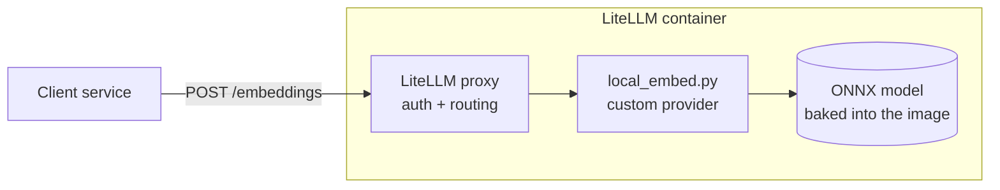

# litellm-local-embeddings

A LiteLLM proxy image that computes embeddings in-process instead of forwarding them to Bedrock,
OpenAI or another upstream, plus the experiment that was run to decide which model to put in it.



Routing is stock LiteLLM. The only custom part is the provider at the end of the route:
`local_embed.py` is registered through `custom_provider_map` and runs the model with ONNX Runtime,
so there is no sidecar and no network call.

## 1. Question

A product calls LiteLLM's OpenAI-compatible `/embeddings` endpoint and expects 1536-dimension
vectors, which it uses to cluster and search source code. The planned upstream was a hosted
embedding API. Can the same LiteLLM instance serve those embeddings locally, on CPU, and which
model should it use?

## 2. Hypotheses

- **H1.** A LiteLLM custom provider can serve embeddings in-process while keeping the client
  contract unchanged (endpoint, request and response shape, auth, 1536 dimensions).
- **H2.** A small model (around 30M parameters) is fast enough on CPU to embed a codebase in a
  practical time.
- **H3.** A larger or code-specific model groups related source files measurably better than a
  small one. If H3 fails, a small model is the right default.
- **H4.** Among small models, one from a US publisher performs as well as the common default
  (`bge-small`), so that model origin does not have to be traded against quality.

## 3. Method

**Models.** Eleven models, all with permissive licences. Native vectors smaller than 1536 are
zero-padded, which leaves cosine similarity, dot product and L2 distance unchanged.

| Model | Publisher | Licence | Parameters | Native dim |
|---|---|---|---|---|
| `intfloat/e5-small-v2` | Microsoft | MIT | 33M | 384 |
| `intfloat/e5-base-v2` | Microsoft | MIT | 109M | 768 |
| `ibm-granite/granite-embedding-30m-english` | IBM | Apache-2.0 | 30M | 384 |
| `ibm-granite/granite-embedding-125m-english` | IBM | Apache-2.0 | 125M | 768 |
| `Snowflake/snowflake-arctic-embed-s` | Snowflake | Apache-2.0 | 33M | 384 |
| `Snowflake/snowflake-arctic-embed-m-v1.5` | Snowflake | Apache-2.0 | 109M | 768 |
| `nomic-ai/nomic-embed-text-v1.5` | Nomic AI | Apache-2.0 | 137M | 768 |
| `jinaai/jina-embeddings-v2-base-code` | Jina AI (Germany) | Apache-2.0 | 161M | 768 |
| `BAAI/bge-small-en-v1.5` | BAAI (China) | MIT | 33M | 384 |
| `BAAI/bge-large-en-v1.5` | BAAI (China) | MIT | 335M | 1024 |
| `Alibaba-NLP/gte-Qwen2-1.5B-instruct` | Alibaba (China) | Apache-2.0 | 1.5B | 1536 |

E5 was run with its documented `passage: ` prefix and Nomic with `clustering: `; the others take
raw text. Publisher is the organisation that released the weights. Some reviews also consider where the
research team is based, so check each model against your own model-origin policy.

**Setup.** LiteLLM 1.83.14, ONNX Runtime 1.30, M5 Max MacBook (18 cores). Three runtimes: CPU
inside the container, CPU natively on the host, and GPU natively through CoreML. The upstream
LiteLLM image is x86-only, so the container runs under emulation on this machine; container
figures are therefore a lower bound for real x86 hardware.

**H1, contract.** `test.sh` runs 18 checks from a client on a network with no internet route:
response shape, four auth header styles, OpenAI SDK default and float encodings, base64,
token-array input, batch input, the `dimensions` parameter, over-length input.

**H2, throughput.** `stress.py` runs 15 seconds per scenario at 1, 8, 32 and 64 concurrent
clients with one ~130-token text per request. `embed_dir.py` times embedding the `src` directory
of [spring-petclinic](https://github.com/spring-projects/spring-petclinic): 93 files, 371 chunks
of up to 1,500 characters, 16 concurrent requests.

**H3 and H4, clustering quality.** `quality.py` embeds every Java file under `src/main/java` in
three multi-module Spring codebases and checks whether the vectors recover each file's module:

| Corpus | Files | Modules |
|---|---|---|
| [spring-petclinic-microservices](https://github.com/spring-petclinic/spring-petclinic-microservices) | 50 | 5 |
| [piggymetrics](https://github.com/sqshq/piggymetrics) | 66 | 4 |
| [ftgo-application](https://github.com/microservices-patterns/ftgo-application) | 274 | 9 |

One vector per file (mean of its chunk vectors). The label is the file's top-level module.
`package` and `import` lines are stripped and paths are not embedded, so the module name does not
leak into the text. Three measures, each compared against random vectors:

- **kNN accuracy**: leave-one-out, does the majority of a file's 5 nearest neighbours share its module.
- **k-means NMI**: k-means with k = number of modules, 10 seeds.
- **UMAP + HDBSCAN NMI**: BERTopic's default pipeline (UMAP to 5 dimensions, then HDBSCAN), 5 seeds.

## 4. Results

### H1: contract

18 of 18 checks pass on the default build. The container also serves requests with networking
disabled (`--network none`). The E5, Granite and Qwen outputs were compared with their reference
implementations through sentence-transformers and are identical (cosine 1.0).

### H2: throughput

Measured for the default, the fastest alternative, the earlier baseline and the larger models:

| CPU, container (emulated x86) | e5-small | granite-30m | bge-small | jina-code | bge-large | Qwen |
|---|---|---|---|---|---|---|
| Embed PetClinic `src` | 19 s | 10 s | 15 s | 73 s | 188 s | 747 s |
| Peak requests per second | 51 | 93 | 56 | 15 | 6 | 1.4 |
| Image size | 0.7 GB | 0.6 GB | 0.7 GB | 1.0 GB | 1.4 GB | 5.9 GB |

| CPU, native | e5-small | granite-30m | bge-small | jina-code | bge-large | Qwen |
|---|---|---|---|---|---|---|
| Embed PetClinic `src` | 5 s | 2.5 s | 4.5 s | 16 s | 46 s | 318 s |
| Peak requests per second | 209 | 303 | 208 | 69 | 22 | 5 |

Container memory under load was about 2 GB for the small models, 3.3 GB for jina-code and 11 GB
for Qwen. No CPU run returned an error.

GPU through CoreML was tried on three models: slower than CPU for bge-small (121 vs 208
requests per second), faster for bge-large (81 vs 22), and Qwen failed to load. It also crashed
on batches of 32 under sustained load, so it is not a usable path. No NVIDIA GPU was tested.

### H3 and H4: clustering quality

"Mean" is the average of the nine scores (three measures on three corpora). The other columns
are the largest corpus, ftgo. Higher is better.

| Model | Mean of 9 | kNN accuracy | k-means NMI | UMAP + HDBSCAN NMI |
|---|---|---|---|---|
| random vectors | 0.12 | 0.17 | 0.06 | 0.08 |
| **e5-small** | **0.38** | 0.65 | 0.20 | 0.31 |
| bge-small | 0.38 | 0.65 | 0.30 | 0.34 |
| bge-large | 0.37 | 0.64 | 0.22 | 0.28 |
| e5-base | 0.37 | 0.65 | 0.23 | 0.29 |
| nomic | 0.37 | 0.61 | 0.25 | 0.30 |
| Qwen | 0.36 | 0.65 | 0.22 | 0.32 |
| granite-30m | 0.35 | 0.58 | 0.18 | 0.31 |
| jina-code | 0.33 | 0.58 | 0.14 | 0.28 |
| arctic-s | 0.29 | 0.58 | 0.13 | 0.25 |
| granite-125m | 0.29 | 0.58 | 0.15 | 0.29 |
| arctic-m | 0.28 | 0.53 | 0.12 | 0.23 |

Every model is well above random. The top six are within about 0.02 of each other on the mean,
which is inside the noise of corpora this small. The one visible gap between the two leaders is
k-means on ftgo, where bge-small is ahead of e5-small (0.30 vs 0.20); e5-small is ahead on the two
smaller corpora. Size does not help: within each family the larger
model scores the same or lower (e5-base vs e5-small, granite-125m vs granite-30m, bge-large vs
bge-small), and the 1.5B-parameter Qwen sits mid-table. The code-specific model is below the
general-purpose small models. Per-corpus scores and ARI are in `results/quality.jsonl`.

## 5. Limitations

- **The module label is a proxy.** Files in different services often play the same role
  (controller, entity, configuration) and look alike, which caps the achievable score for every
  model. Absolute values are modest for that reason; the comparison between models is the useful part.
- **Small corpora, one language.** The two small corpora (50 and 66 files) are noisy, and all
  three are Java/Spring. Differences of a few hundredths are not significant. Other languages
  were not tested.
- **Not the product's pipeline.** The UMAP + HDBSCAN run uses BERTopic's default parameters on
  file-level vectors. The real pipeline's chunking, parameters and data will differ.
- **512-token inputs.** Jina, Nomic and Qwen accept much longer inputs; that advantage was not exercised.
- **Qwen was used without an instruction prefix**, as its model card recommends for documents.
- **Nomic was not checked against its reference implementation**, which requires running custom
  code from the model repository.
- **Container speed is emulated x86.** Native x86 throughput was not measured.

## 6. Conclusion

- **H1 holds.** LiteLLM serves embeddings in-process with the client contract intact and no
  outbound network access.
- **H2 holds.** The small models embed a small Spring codebase in 10 to 19 seconds in an emulated
  container and sustain 50 to 90 requests per second; native CPU is about four times faster.
- **H3 is not supported.** Neither the larger models nor the code-specific model grouped source
  files better than the small ones. Qwen costs 40 to 50 times the compute and about 9 times the
  image size for no measured gain.
- **H4 holds.** `e5-small-v2` (Microsoft, MIT) matches `bge-small` on quality and speed.

**Recommendation: `e5-small-v2`, which is the default build.** It ties the best quality score,
has the same footprint as bge-small, and comes from a US publisher. If the review prefers a
vendor with documented training-data provenance, `granite-embedding-30m-english` (IBM) is about
twice as fast and scores slightly lower. The Qwen build is kept only for the case where native
1536-dimension vectors are a hard requirement.

Two things this does not establish:

- That a small model is sufficient for the product in absolute terms. The evidence is that larger
  models do not do better on this kind of data. The remaining step is to run the product's own
  clustering on a real codebase with this image and compare against its current baseline.
- That cosine thresholds carry over. E5 similarities sit in a narrow high band (unrelated texts
  often score 0.75 or more), so any fixed similarity cut-off tuned for another model needs
  re-tuning. Rank-based logic (nearest neighbours, clustering) is unaffected.

## 7. Running it

### Default build (e5-small-v2)

Requires Docker. The build pulls LiteLLM and the model, about 700 MB in total.

```bash
git clone https://github.com/farid809/litellm-local-embeddings.git
cd litellm-local-embeddings
docker compose up -d --build litellm
```

```bash
curl -s http://localhost:4002/embeddings \
  -H "Authorization: Bearer sk-test-master" \
  -H "Content-Type: application/json" \
  -d '{"model": "amazon.titan-embed-text-v1", "input": "hello world"}'
```

To build with another model, override the build arguments. The repo needs an ONNX file,
`tokenizer.json` and `1_Pooling/config.json`. For example, IBM Granite:

```bash
docker build --platform linux/amd64 -t litellm-local-embed:granite \
  --build-arg EMBED_MODEL_REPO=ibm-granite/granite-embedding-30m-english \
  --build-arg EMBED_MODEL_REV=main \
  --build-arg EMBED_ONNX_PATH=model.onnx \
  --build-arg EMBED_PREFIX= .
```

`EMBED_ONNX_PATH` is `model.onnx` or `onnx/model.onnx` depending on the publisher. `EMBED_PREFIX`
is the text the model expects before each input: `passage: ` for E5, empty for most others.

### Qwen build (native 1536)

The model is not published in ONNX format, so convert it once on the host, then build. The
conversion downloads about 7 GB and needs roughly 20 GB of RAM. It loads the model with
`trust_remote_code`, pinned to a fixed revision.

```bash
pip install torch==2.5.1 transformers==4.44.2 onnx "numpy<2"     # Python 3.11 or 3.12
python export_onnx.py ./qwen-model
docker compose --profile qwen up -d --build litellm-qwen
```

It listens on port 4003. Give Docker at least 12 GB of memory.

### Without compose

```bash
docker build --platform linux/amd64 -t litellm-local-embed .
docker run -d -p 4000:4000 -e LITELLM_MASTER_KEY=sk-change-me litellm-local-embed
```

For Qwen add `-f Dockerfile.qwen`. To deploy, push the image to your registry and use it in place
of the stock LiteLLM image. The container needs no outbound network access at runtime.

### Reproducing the experiment

```bash
./test.sh                                                  # H1
pip install httpx numpy scikit-learn umap-learn
python stress.py http://localhost:4002                     # H2
python embed_dir.py http://localhost:4002 /path/to/src     # H2
python quality.py http://localhost:4002 e5-small /path/to/repo [...]   # H3, H4
```

## 8. Configuration

`config.yaml` maps model names to the local provider:

```yaml
model_list:
  - model_name: amazon.titan-embed-text-v1      # name the client sends
    litellm_params:
      model: local-embed/local                  # route to the in-process provider
    model_info:
      mode: embedding
  - model_name: "*"                             # catch-all for any other name
    litellm_params:
      model: local-embed/*
    model_info:
      mode: embedding

litellm_settings:
  custom_provider_map:
    - provider: local-embed
      custom_handler: local_embed.local_embed   # resolved relative to this file's directory

general_settings:
  master_key: os.environ/LITELLM_MASTER_KEY
```

LiteLLM resolves `custom_handler` relative to the config file, so `local_embed.py` has to sit in
the same directory. The image puts both in `/etc/litellm/`. If you mount your own config
elsewhere, mount the handler next to it; otherwise the proxy exits at startup.

| Variable | Default | Purpose |
|---|---|---|
| `LITELLM_MASTER_KEY` | required | API key clients send |
| `EMBED_DIM` | `1536` | Output dimension. Smaller native sizes are zero-padded, larger ones truncated and re-normalised |
| `EMBED_MAX_TOKENS` | `512` | Inputs are truncated to this length |
| `EMBED_PREFIX` | `passage: ` | Text prepended to every input; set by the build for the chosen model |
| `EMBED_BATCH` | `32` (`8` for Qwen) | Texts per inference batch |
| `EMBED_THREADS` | auto | ONNX Runtime CPU threads |
| `EMBED_PROVIDERS` | CPU | ONNX Runtime execution providers, for example `CUDAExecutionProvider` with `onnxruntime-gpu` |

Clients keep whatever already points at LiteLLM: `http://litellm:4000/embeddings` (or base URL
`http://litellm:4000` for SDKs), with the master key sent as `Authorization: Bearer`, `x-api-key`,
`api-key` or `x-litellm-api-key`.

## 9. Operational notes

- **Vectors are not interchangeable between models**, including any hosted model. Build and query
  an index with one model, and re-embed existing data when switching.
- **OpenAI-compatible API only.** The proxy accepts Bedrock model names but does not implement the
  Bedrock-native `InvokeModel` request format.
- **Tested against LiteLLM 1.83.14.** The handler registers itself in an internal LiteLLM list so
  that `encoding_format` and `dimensions` reach it. Rebuild with
  `--build-arg LITELLM_IMAGE=<image>:<tag>` and rerun `./test.sh` when changing versions.
- **The `"*"` route is embeddings-only.** Remove it before adding chat models to the same config.
- **Inference shares the proxy process.** Size the pod's CPU and memory for the model, and cap
  threads with `EMBED_THREADS` if chat traffic goes through the same instance.
