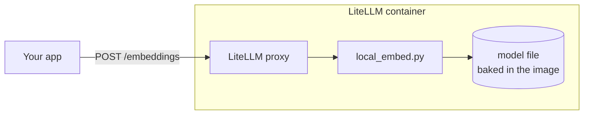

# litellm-local-embeddings

Run embeddings **inside the LiteLLM container**. No Bedrock, no OpenAI, no second service.

Your app keeps calling LiteLLM the same way. LiteLLM just answers by itself.



## Run it

You only need Docker.

```bash
git clone https://github.com/farid809/litellm-local-embeddings.git
cd litellm-local-embeddings
docker compose up -d --build litellm
```

First build downloads LiteLLM and the model (about 700 MB total). Then test it:

```bash
curl -s http://localhost:4002/embeddings \
  -H "Authorization: Bearer sk-test-master" \
  -H "Content-Type: application/json" \
  -d '{"model": "amazon.titan-embed-text-v1", "input": "hello world"}'
```

You get back the normal OpenAI-style response with a 1536-number vector.

Stop it with `docker compose down`. Run all checks with `./test.sh`.

## Run it without compose

```bash
docker build --platform linux/amd64 -t litellm-local-embed .
docker run -d -p 4000:4000 -e LITELLM_MASTER_KEY=sk-change-me litellm-local-embed
```

Then call `http://<host>:4000/embeddings` with `Authorization: Bearer sk-change-me`.

To ship it to a cluster, push that image to your registry and use it in place of the LiteLLM image.

## Configuration

Everything is in three small files.

**`config.yaml`** — tells LiteLLM which model names go to the local model:

```yaml
model_list:
  - model_name: amazon.titan-embed-text-v1      # the name your app sends
    litellm_params:
      model: local-embed/bge-small-en-v1.5      # local-embed = run it here
    model_info:
      mode: embedding
  - model_name: "*"                             # any other name works too
    litellm_params:
      model: local-embed/*
    model_info:
      mode: embedding

litellm_settings:
  custom_provider_map:
    - provider: local-embed
      custom_handler: local_embed.local_embed   # local_embed.py, next to this file

general_settings:
  master_key: os.environ/LITELLM_MASTER_KEY
```

**`local_embed.py`** — the code that runs the model. It must sit in the same folder as `config.yaml`.

**`Dockerfile`** — LiteLLM + ONNX Runtime + the model file.

Environment variables:

| Variable | Default | What it does |
|---|---|---|
| `LITELLM_MASTER_KEY` | (required) | The API key callers send |
| `EMBED_DIM` | `1536` | Vector size |
| `EMBED_THREADS` | auto | CPU threads for the model |
| `EMBED_MAX_TOKENS` | `512` | Longer text gets cut |

On the app side, nothing changes:

| Setting | Value |
|---|---|
| `LITELLM_EMBEDDING_URL` | `http://litellm:4000/embeddings` |
| `LITELLM_PROXY_API_BASE` | `http://litellm:4000` |
| `LITELLM_EMBEDDING_PROXY_API_KEY` | same as `LITELLM_MASTER_KEY` |

## How fast is it

Measured on an M5 Max MacBook. Raw numbers are in `results/`.

**Real example: embed the `src` folder of [spring-petclinic](https://github.com/spring-projects/spring-petclinic)**
(93 files, 371 chunks, about 165k tokens; 16 requests at a time)

| Where | `bge-small` (default) | `bge-large` |
|---|---|---|
| CPU, in the container | 15 s | 188 s |
| CPU, on the Mac directly | 4.5 s | 46 s |
| GPU, on the Mac directly (CoreML) | 12 s | 30 s |

**Load test: best requests per second** (`stress.py`, one ~130-token paragraph per request)

| Where | `bge-small` | `bge-large` |
|---|---|---|
| CPU, in the container | 56 | 6 |
| CPU, on the Mac directly | 208 | 22 |
| GPU, on the Mac directly (CoreML) | 121 | 81 |

What this says:

- **Small model: use CPU.** The GPU is slower because the model is too small to benefit.
- **Large model: GPU helps** (about 4x under load), but it is still about 10x slower than the
  small model on CPU.
- **The container numbers are the worst case.** This LiteLLM image is x86 only, so on a Mac it
  runs emulated. A real x86 server should be closer to the "CPU on the Mac" row (not measured here).
- No request failed in any CPU run. The CoreML GPU path crashed when sent batches of 32 texts
  under load, with both models.

Try the large model: `docker build --platform linux/amd64 --build-arg EMBED_MODEL_REPO=BAAI/bge-large-en-v1.5 -t litellm-local-embed:large .`
(adds about 1.3 GB to the image).

Run the tests yourself (`pip install httpx`):

```bash
python stress.py http://localhost:4002
python embed_dir.py http://localhost:4002 /path/to/some/src
```

## Good to know

- **These are not Bedrock vectors.** The model is `bge-small-en-v1.5` (384 numbers) padded with
  zeros to 1536. Search quality is not affected by the padding, but don't mix these vectors with
  ones Bedrock made in the same index.
- **OpenAI-style API only.** It accepts Bedrock model names, not the Bedrock-native request format.
- **Tested on LiteLLM 1.83.14.** For another version: `--build-arg LITELLM_IMAGE=<image>:<tag>`,
  then run `./test.sh`.
- **Embeddings only.** Remove the `"*"` entry before adding chat models to `config.yaml`.
